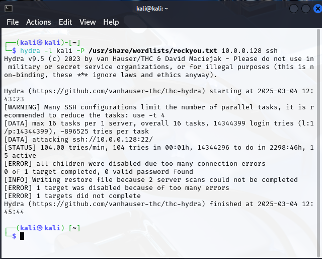
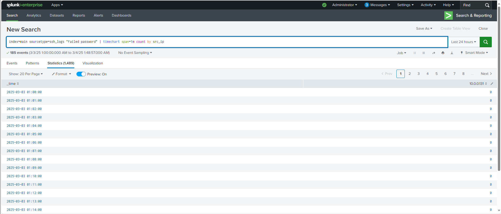
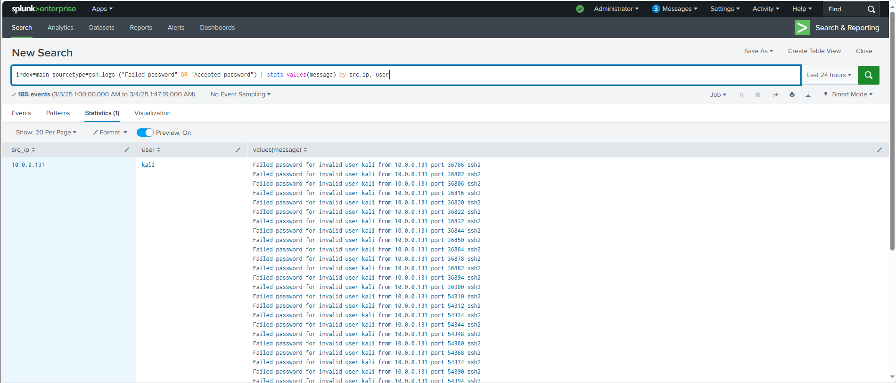
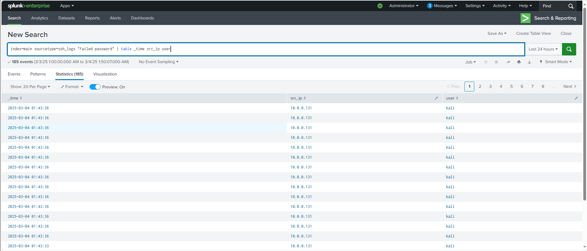

# 🚀 Detecting SSH Brute Force Attacks Using Splunk SIEM

## 📌 Project Overview
This project demonstrates how to **detect SSH brute-force attacks** using **Splunk SIEM**. It involves simulating an SSH attack with **Hydra**, collecting logs using **Splunk Universal Forwarder**, and analyzing logs in **Splunk** to detect brute-force attempts.

---

## 🛠 Technology Stack
- **Operating System:** Ubuntu 22.04 (Target & Attacker Machines)
- **SIEM Tool:** Splunk Enterprise
- **Log Forwarding Tool:** Splunk Universal Forwarder
- **Attack Tool:** Hydra
- **Threat Intelligence:** VirusTotal & AbuseIPDB

---

## 📥 Steps to Detect Brute Force Attacks

### **Step 1: Simulate SSH Brute Force Attack Using Hydra**
On the **attacker machine**, install Hydra:

```bash
sudo apt update && sudo apt install hydra -y
```

Run Hydra to attack the target:
```bash
hydra -l ubuntu -P /usr/share/wordlists/rockyou.txt <target-IP> ssh
```

- -l ubuntu → Specifies the username to attack
- -P rockyou.txt → Uses a password list to brute-force SSH

Step 2: Detect SSH Brute Force Attempts in Splunk
Open the Splunk Web Interface (http://<splunk-server-ip>:8000)
Go to Search & Reporting and run the following queries:

🔍 Detect multiple failed SSH login attempts
```bash
index=main sourcetype=ssh_logs "Failed password" | stats count by src_ip, user
```

🔍 Detect high login attempts from a single IP
```bash
index=main sourcetype=ssh_logs "Failed password" | timechart span=1m count by src_ip
```


🔍 Check for successful logins after failures
```bash
index=main sourcetype=ssh_logs ("Failed password" OR "Accepted password") | stats values(message) by src_ip, user
```



Step 3: Extract Indicators of Compromise (IOCs)
- Extract attacker IPs from logs:
```bash
index=main sourcetype=ssh_logs "Failed password" | table _time src_ip user
```

- Verify IPs using VirusTotal & AbuseIPDB

📸 Screenshots


🎯 Key Learnings
- Understanding SIEM log analysis & threat detection.
- Detecting brute-force attacks in Splunk.
- Threat intelligence using VirusTotal & AbuseIPDB.
- Creating Splunk dashboards & security queries.
